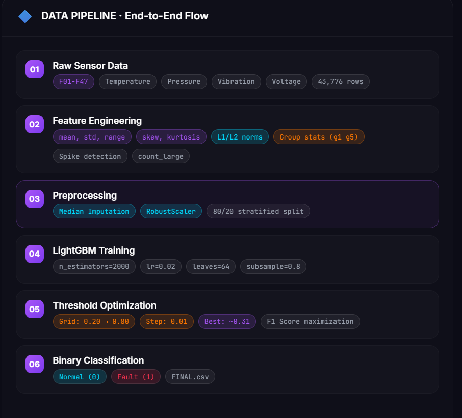

**Intelligent Machine Learning Framework for Fault Detection in Embedded Sensor Systems**

Overview

Modern embedded systems rely on multiple sensors to monitor operational conditions such as temperature, pressure, vibration, and electrical signals. Detecting abnormal behavior early is essential to prevent system failure and enable predictive maintenance.

This project presents a machine learning–based fault detection framework that analyzes multivariate sensor telemetry and automatically classifies whether a device is operating normally or experiencing a fault condition.

The model learns patterns from 47 continuous sensor measurements and predicts device state using an advanced feature-engineered LightGBM classifier.

The solution was developed as part of the IEEE SB GEHU Machine Learning Challenge.

Problem Statement
**In industrial and embedded environments, large volumes of sensor data are generated continuously. Traditional rule-based monitoring systems depend on manually defined thresholds and often fail to detect complex or subtle anomalies.
**

The goal of this project is to design an intelligent system capable of:

 * Learning patterns from high-dimensional sensor data.

 * Detecting abnormal device behavior automatically.

 * Maintaining high prediction accuracy while minimizing false alarms.

The problem is formulated as a binary classification task.

Class	                       Description
0	                           device operation
1	                           Fault condition detected

Dataset Description
The dataset contains telemetry information from embedded monitoring systems.

Training Data: 43,776 samples

Testing Data: 10,944 samples

Each sample contains 47 numerical features:

F01 – F47: These represent sensor signals collected from the system during operation.

Dataset Characteristics

Multivariate sensor measurements

Continuous numerical values

Binary classification labels

High dimensional feature space

Potential nonlinear relationships between sensors

To enhance predictive power, additional statistical features are generated during the feature engineering stage.

## System Pipeline

